# Dpublish
Distributed platform for peer-reviewing scientific articles based on the Ethereum Blockchain.

# Setting up the project

This project uses openzeppelin contrats, so make sure to install it in your project folder:

```bash
$ npm install @openzeppelin/contracts
```

# Relatório 


Foi interessante fazer o projeto, porém passei bastante tempo lidando com os erros e aprendendo um pouco da linguagem solidity. O meu resultado final foi parte do que foi pedido. Tentei fazer o máximo possível e vou relatar tudo aqui.


### Primeira parte : Definição de algumas variáveis

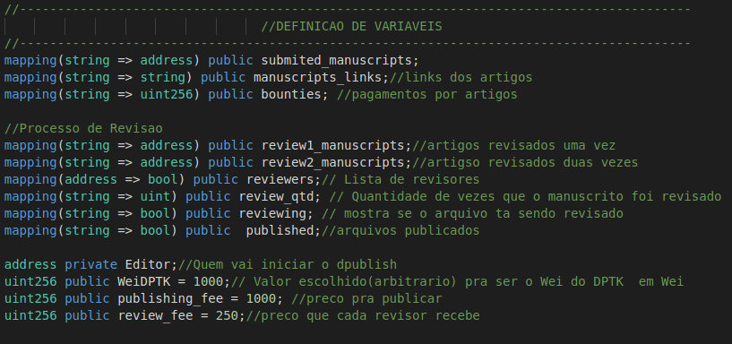

Na imagem acima temos a parte do código direcionado a isso, todas linhas estão comentadas, dizendo o que cada uma faz.

### Segunda parte : Simuladores de Tokens

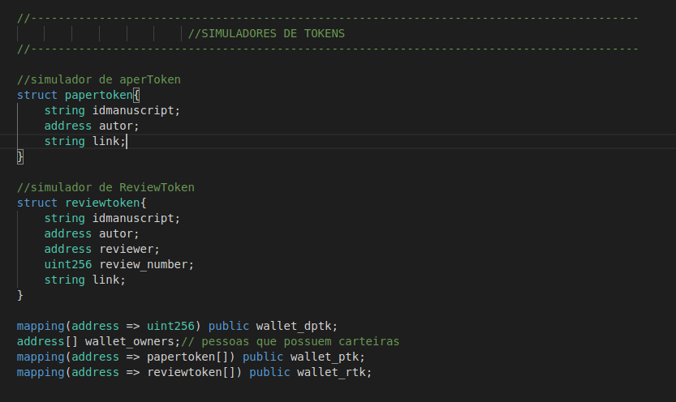

Como não consegui conectar o contrado `DPublish.sol` com os demais, decidi então fazer então uma simulação dos tokens, para o PaperToken e ReviewToken eu criei uma estrutura de dados pra cada. Abaixo das estruturas temos os mappings representando as carteiras de cada token.

### Terceira parte : EVENTOS, ERROS E CONSTRUTOR

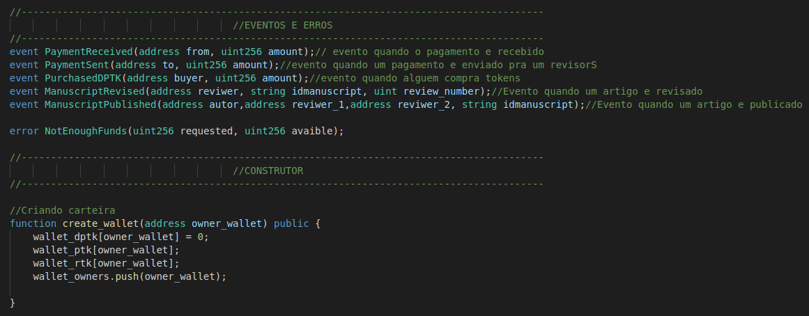

Nessa terceira parte criei alguns eventos pra quando um pagamento é recebido e enviado, quando alguém compra DPubTokens e  um ReviewToken ou PaperToken é emitido , e também é adicionado um erro quando a quantidade de dinheiro não é suficiente. No construtor temos uma função que cria uma carteira, ela é usada pelo Editor, que recebe um valor arbitrário de DPubTokens. 

### Quarta parte : FUNÇÕES AUXILIARES

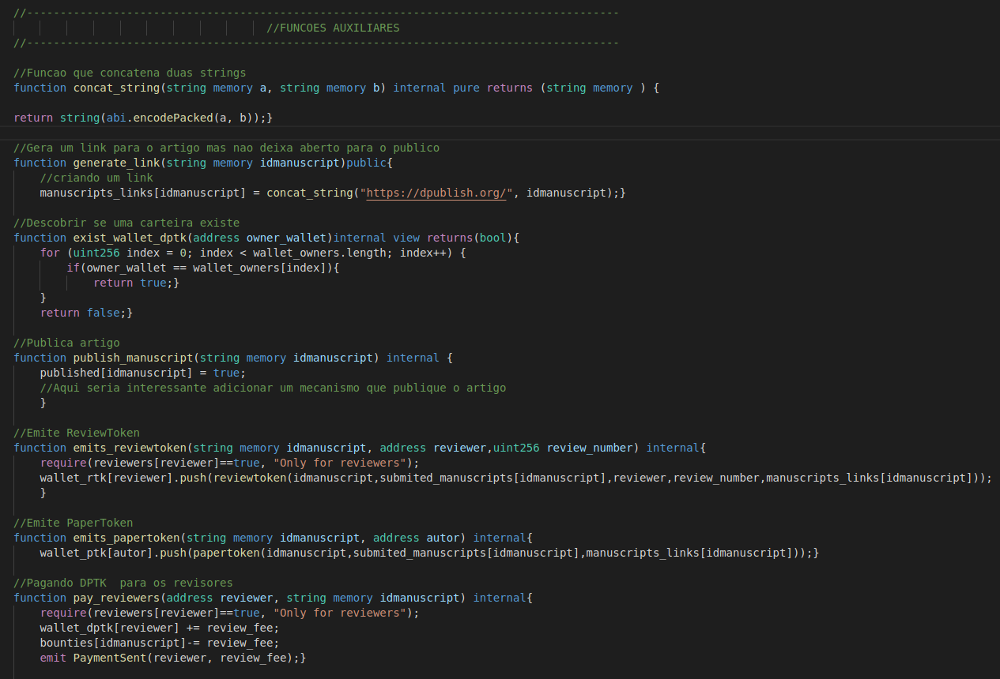

Aqui  são criadas algumas funções auxiliares que ajudaram nas próximas parte do projeto. Uma função que concatena duas strings, uma geradora de link, funções que simulam a emissão de ReviewToken e PaperToken e a publicação de um artigo. Uma função que diz se um endereço tem uma carteira de DPubToken. E por fim uma função que paga os revisores.

### Quinta parte : OBTER E CONFIGURAR VALORES DE PAGAMENTO

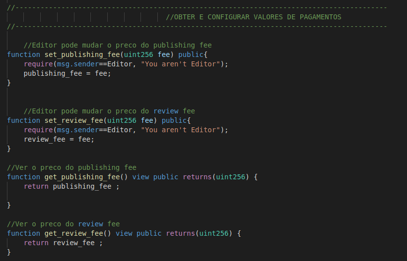

Temos funções que o Editor pode configurar os valores de uma submissão de artigo e o valor que cada revisor recebe. E outras duas que qualquer pessoa pode usar, que retornam os valores da submissão e o valor que cada revisor recebe.

### Sexta parte : COMPRA DE DPubTokens E SUBMISSÃO DE ARTIGO

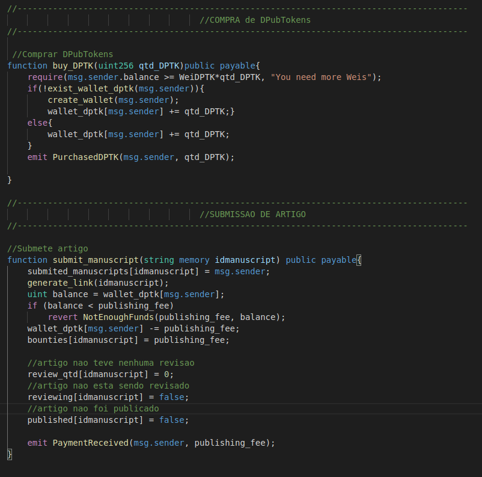

Na imagem acima temos uma função onde a pessoa que chama ela faz uma compra de DPubTokens, caso essa pessoa não tenha carteira, é criada uma pra ela. O balanço dela precisa ser maior ou igual ao valor da quantidade de DPubToken que ela deseja comprar.

Já na função de submissão de artigo, é gerado um link do seu artigo, mas esse link não é para o público. Caso o autor não tenha a quantidade suficiente de DPubTokens então a função retorna um erro, já se ele tiver o valor é descontado da sua carteira e adicionado em bounties. Depois são feitas algumas definições que auxiliarão no processo de revisão.  Ao final é emitido um evento de que o pagamento foi recebido.

### Sétima parte : PROCESSO DE REVISÃO

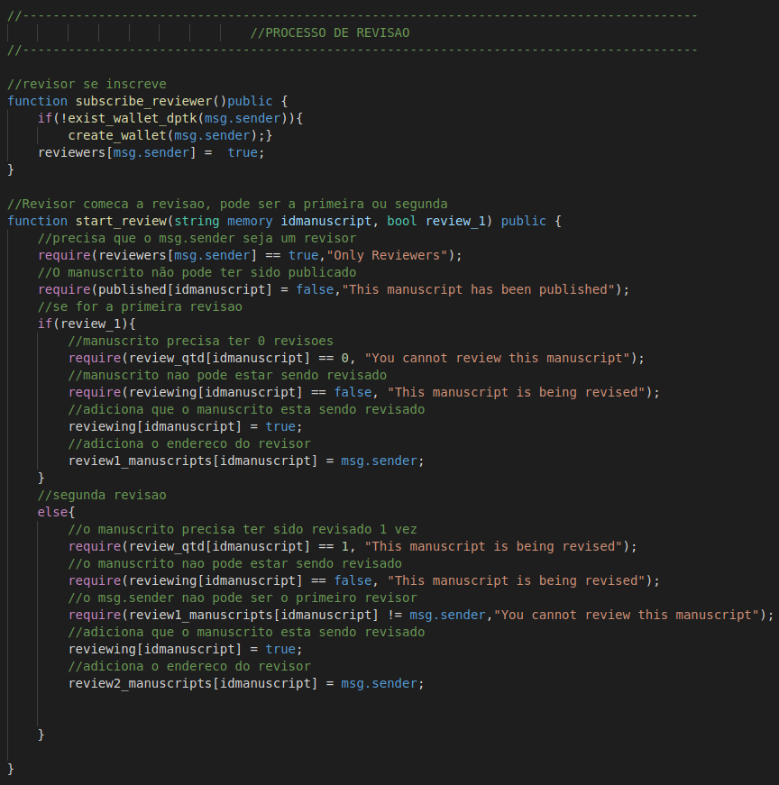
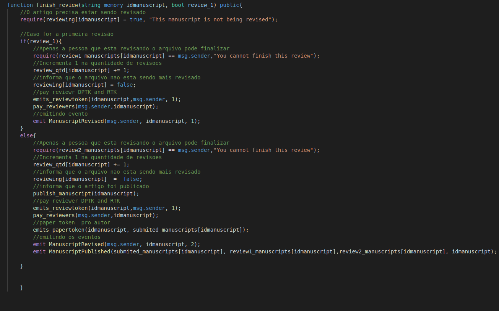

Na primeira imagem temos duas funções, a primeira função serve para um revisor se inscrever como revisor, caso ele não tenhe uma carteira é criada uma pra ele. Caso esse revisor tenha comprado DPubTokens ele já tem sua carteira e não precisa ser criada.

A segunda função server para começar a revisão, ele pode escolher qual revisão ele estará fazendo, se for a primeira, o segundo parâmetro será igual a `True`, caso seja a segunda será `False`. Apenas pessoas inscritas como revisores podem chamar essa função. As linhas estão todas comentadas, dizendo pra que serve cada linha.

Na segundo imagem e nossa terceira função dessa parte, temos uma função que finaliza a revisão. Novamente o revisor pode escolher qual revisão está finalizando, apenas o revisor que começou a revisão pode finalizá-la. Ao finalizar a primeira revisão, o revisor recebe seu ReviewToken e seu pagamento e um evento é emitido. Já na segunda revisão o revisor recebe seu ReviewToken e seu pagamento, mas agora o artigo é publicado e o PaperToken do autor é emito, além da emissão de dois eventos.


### Erro na primeira versão

Durante o projeto aprendi muito de solidity e muito foram pelos erros e por pesquisas por exemplo, porém teve um erro que não consegui consertar e vou falar um pouco sobre ele aqui, o arquivo com essa versão pode ser encontrado nesse arquivo [`./dpublish.sol`](./dpublish.sol). Vamos ver a imagem abaixo pra entender esse erro melhor.

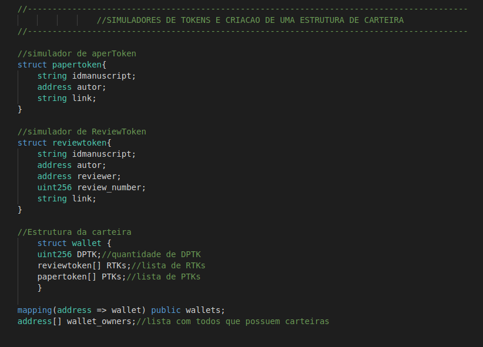
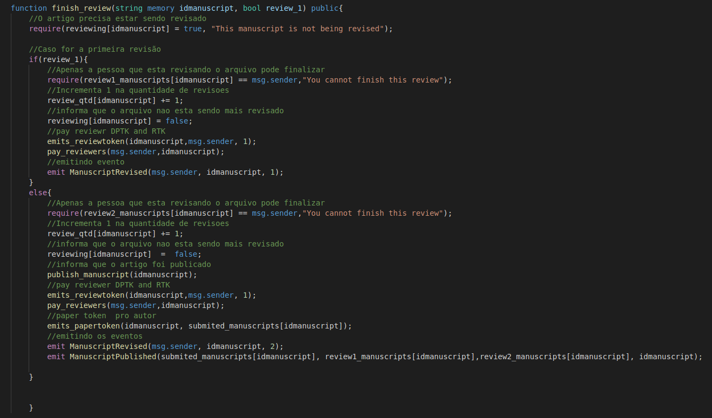


Na primeira parte temos as estruturas dos Tokens não fungíveis e também uma estrutura de carteira pra pessoa, com todos os possíveis Tokens que essa pessoa pode ter, note que os Tokens não fungíveis são um Array. Porém, aí que estã o problema quando fui compilar o código e adicionar uma lista vazia nos dois tokens como pode-se ver na segunda imagem. Então quando fui compilar tive o seguinte erro.

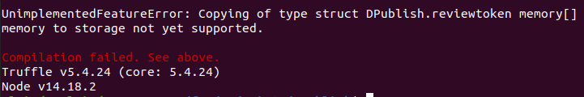

Que diz que os tipos não são suportados, procurei várias maneiras para consertar esse erro, mas não encontrei muita coisa sobre e infelizmente não consegui resolver.


### Conclusão

Fazendo o trabalho me dediquei a aprender mais sobre os smart contracts, a linguagem solidity e esse mundo imenso da blockchain. Achei meu resultado final interessante, mesmo não estando totalmente completo. Busquei modelar o trabalho o mais próximo do mundo real possível. Solidity é uma linguagem poderosa, mas não tão fácil de aprender, precisa de bastante tempo e esforço, e ela está sempre sendo atualizada, então um desenvolvedor de blockchain precisa sempre estar ligado com as mudanças e os avanços da linguagem.


